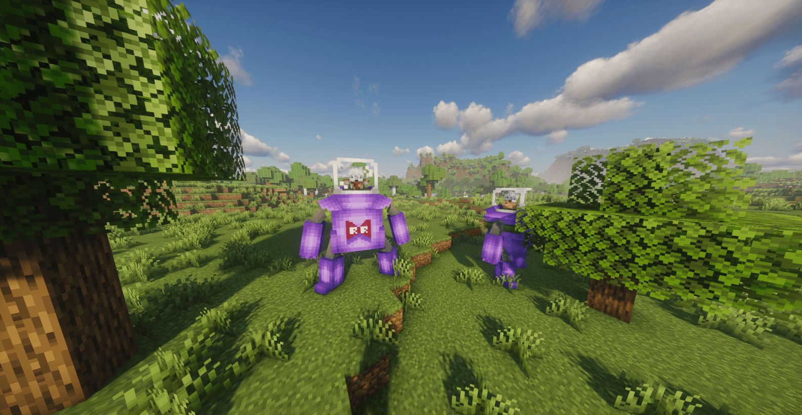
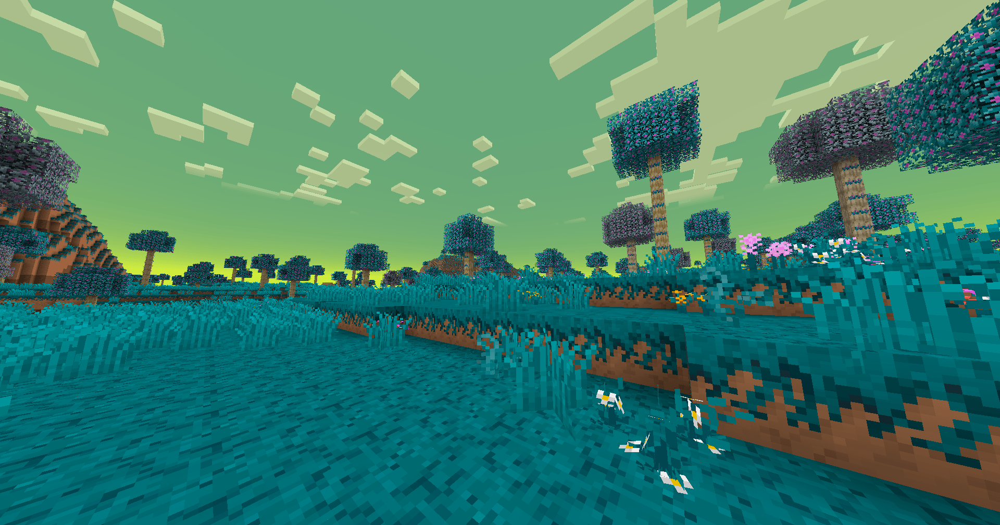
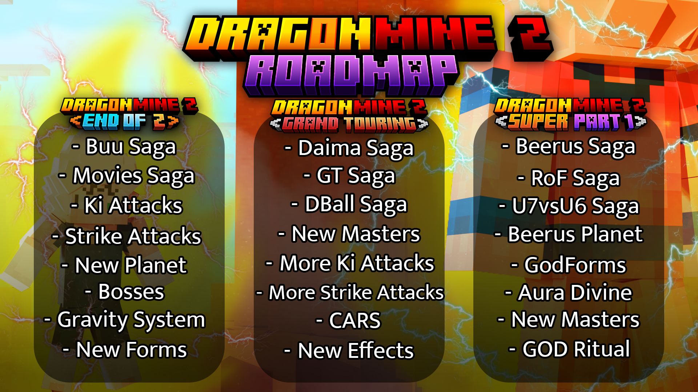

  

**English** · [Español](README_ES.md) · [Português](README_PT.md)

---

## About

**DragonMine Z** is an immersive **Work-In-Progress Minecraft Forge 1.20.1 mod** inspired by Akira Toriyama's most-famous work, [Dragon Ball](https://en.dragon-ball-official.com/).

Our goal is to bring the full Dragon Ball experience into Minecraft: custom characters, races, transformations, skills, stats, story content, dimensions, NPCs, structures, and a revamped survival experience.

The project is still in active development, so features may change as we keep improving the mod.

---

## ✨ Features

- Create your own Dragon Ball-inspired character.
- Choose from multiple races, including Saiyan, Human, Namekian, Frost Demon, Bio-Android, and Majin.
- Customize your appearance with hair, eyes, skin, aura colors, and more.
- Progress through stats such as Strength, Strike Power, Resistance, Vitality, Ki Power, and Energy.
- Unlock skills, transformations, combat abilities, and new ways to grow stronger.
- Explore new locations, dimensions, NPC encounters, structures, and story content.
- Experience Minecraft survival with a Dragon Ball progression system layered on top.

---

## 🖼️ Showcase

<table>
  <tr>
    <td align="center" width="50%">
      
       
      <strong>Red Ribbon Robots</strong>
       
      Preview of two Red Ribbon robot enemies being in DragonMine Z as part of the enemy roster.
    </td>
    <td align="center" width="50%">
      
       
      <strong>Namek Environment Preview</strong>
       
      Background showcase inspired by Namek, presenting the atmosphere and visual direction of the mod.
    </td>
  </tr>
</table>

---

## 🚀 Download

You can download DragonMine Z from our official mod pages:

- [CurseForge](https://www.curseforge.com/minecraft/mc-mods/dragonminez)
- [Modrinth](https://modrinth.com/mod/dragonminez)

DragonMine Z is made for **Minecraft Forge 1.20.1**.

---

## 🫴 Support the Project

Want early previews and extra behind-the-scenes updates?

Join our [Patreon](https://patreon.com/DragonMineZ) to support development and get access to previews and similar perks. Your support helps us keep improving DragonMine Z and creating more content for the community.

You can also join our [Discord server](https://discord.gg/b5MgRNb3D7) to follow development, report bugs, suggest ideas, and talk with the community.

---

## 🗺️ Roadmap

  

You can also follow our public [GitHub Progress Board](https://github.com/orgs/DragonMineZ/projects/4).

---

## 🤝 Contributing

Would you like to help? Cool! Check out the [contribution guide](.github/CONTRIBUTING.md) to get started.

You can help with:

- Code contributions
- Bug reports
- Feature suggestions
- Translations
- Documentation
- Models, animations, builds, and other creative work

---

## 🎯 Use of Third Parties

### Sounds

Some sounds are used from [Zapsplat](https://www.zapsplat.com/) and [Freesound](https://freesound.org/):

- [Dragon Ball Scouter/Tracker Remade.wav](https://freesound.org/s/518004/) by Pablobd | License: Attribution 3.0
- [A Symphony for Akira Toriyama](https://www.youtube.com/watch?v=xNVEkSerkU0) by GLADIUS | License: CC-BY License

### Acknowledgments

This project includes code from [GeckoLib](https://github.com/bernie-g/geckolib), which is licensed under the MIT License.

Copyright © 2025 GeckoThePecko. See the [`THIRD_PARTY_LICENSES`](THIRD_PARTY_LICENSES) file for details.

---

## ✨ Authors

### Developers

- [Yuseix](https://github.com/yuseix300) | *Co-Founder & Programmer*
- [ezShokkoh](https://github.com/Shokkoh) | *Co-Founder & Programmer*
- [Bruno](https://github.com/Bruneitor123) | *Co-Founder, Programmer & Community Admin*

### Contributors

- [Bati2ra](https://github.com/Bati2ra) | *Programmer*
- [KyoSleep](https://github.com/KyoSleep1) | *Programmer*
- JotaJoestar | *Modeler and Animator*
- Toji71_ | *Builder*

---

## License

2026, DragonMine Z.

This program is free software: you can redistribute it and/or modify it under the terms of the GNU General Public License as published by the Free Software Foundation, either version 3 of the License or, at your option, any later version.

[GNU General Public License v3.0](https://github.com/DragonMineZ/dragonminez/blob/main/LICENSE)